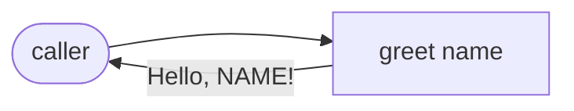

# Demo Greeting — Architecture Overview

A single pure function. No external dependencies. The kernel boundary is the function itself; everything outside (the test runner) is unverified.

## Data flow
- `name: str` enters the function.
- Validation: `name != ""` (precondition).
- Output: literal `"Hello, "` + `name` + `"!"`.

## Verified kernel boundary
`src/demo_greeting/greeting.py`. Tests (`tests/demo_greeting/test_greeting.py`) live outside the kernel.
