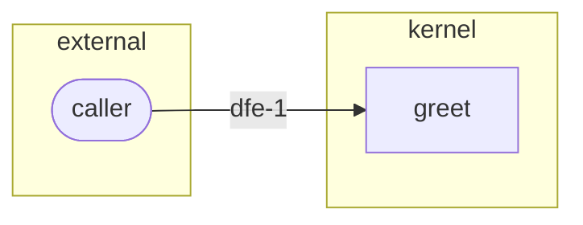

# Demo Greeting — Threat Model

## Narrative
The only external input is the `name` parameter. The function performs no I/O, opens no sockets, reads no files. Trust boundary is between the caller and the function body.

## STRIDE coverage
- `dfe-1` (name-input): T (tampering). A caller may pass a maliciously-crafted string. Mitigation: precondition rejects empty strings; output is purely deterministic so no injection sink exists.

## Mitigations
- Precondition validates non-empty.
- Pure function — no eval, no system calls, no logging that could re-serialize attacker input unsafely.

