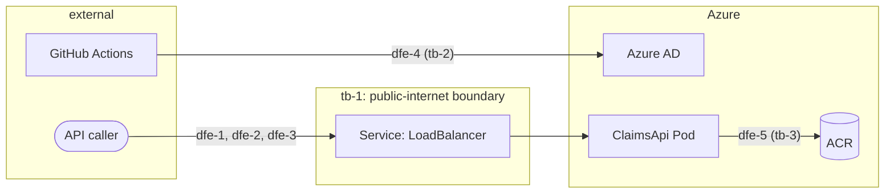

# Claims Status API — Threat Model

## Assets

- **claim-records** (C: M, I: M, A: L) — the in-memory seeded claim
  data served by the API. Rated **M** (not L) for confidentiality
  despite being synthetic: the rating reflects what this *class* of
  data would be if real claimant data were ever substituted in, per
  ADR-004's explicit warning that this pattern is not PHI-safe as
  written. Today's actual exposure is lower because the data is
  synthetic by design (Compliance section of the spec) — but that
  protection is a documentation promise, not a code-enforced control,
  so the asset rating does not assume it holds.
- **ci-cd-deploy-identity** (C: H, I: H, A: M) — the OIDC federated
  identity GitHub Actions assumes to provision/deploy to Azure. Compromise
  here means an attacker can modify infrastructure or push arbitrary
  images, not just read claim data.
- **container-image** (C: L, I: M, A: M) — the built `ClaimsApi` image
  in ACR. Tampering or a vulnerable base/dependency (REQ-307's scan
  target) could compromise the running service.

## Trust boundaries

- **tb-1 (public-internet ⟷ claims-api-service)** — the `LoadBalancer`
  `Service`'s public IP, port 80. This is the boundary ADR-004 formally
  accepts as a named, conditional risk for v1: plain HTTP, no
  authentication, no rate limiting. Carries `dfe-1`, `dfe-2`, `dfe-3`.
- **tb-2 (github-actions ⟷ azure-ad)** — the OIDC token exchange
  (ADR-003) that authorizes CI to act against the Azure subscription.
  Carries `dfe-4`.
- **tb-3 (aks-cluster ⟷ acr)** — image pull authenticated by the
  cluster's managed identity (ADR-003). Carries `dfe-5`; not externally
  reachable, so it has no STRIDE entry in `stride_per_element` per the
  `external: true` requirement, but is documented here for completeness
  since it is still a credential boundary.

## STRIDE coverage

- **dfe-1 (claim-by-id-lookup, `GET /claims/{claimId}`)**
  - **T (Tampering):** a caller supplies a malformed or arbitrary GUID.
    Mitigation: REQ-300 requires GUID parsing with a `400` + RFC 9457
    problem-details response on failure — the malformed input cannot
    reach the repository lookup.
  - **I (Information Disclosure):** an unauthenticated caller can probe
    arbitrary GUIDs and learn whether each maps to a real claim (and its
    status) with no rate limit. Mitigation: **none today** — this is the
    accepted risk under ADR-004, bounded only by the synthetic-data
    promise. Not mitigated in code.
  - **D (Denial of Service):** with no rate limiting (Won't Have),
    nothing stops repeated or scripted lookups against this endpoint
    from generating sustained load. Mitigation: none in this version —
    same out-of-scope decision as `dfe-3`; resource limits (REQ-305)
    bound the blast radius to the pod's own allocation.
- **dfe-2 (claims-full-list, `GET /claims`)**
  - **I (Information Disclosure):** the entire seeded dataset is
    returned to any caller in one unauthenticated request — strictly
    worse than `dfe-1`'s per-id guessing, since no enumeration is even
    required. Mitigation: **none today** — explicitly the headline risk
    named in the spec's Risks section and the fresh-eyes review's
    convergent finding #1; accepted under ADR-004 for v1, conditional on
    synthetic-data-only continuing to hold.
  - **D (Denial of Service):** same rationale as `dfe-1` — a full-dataset
    response is also the most expensive single request this API can
    serve, making it the cheapest target for load generation. Mitigation:
    none in this version, same out-of-scope decision as `dfe-1`/`dfe-3`.
- **dfe-3 (health-check, `GET /health`)**
  - **D (Denial of Service):** unlimited, unauthenticated requests to a
    trivial endpoint could be used to generate load (low severity given
    the handler does no work beyond returning a static body).
    Mitigation: none in this version — explicitly out of scope
    (rate limiting is in Won't Have); AKS/Kubernetes resource
    limits (REQ-305) bound the blast radius to the pod's own CPU/memory
    allocation, not the request rate itself.
- **dfe-4 (ci-oidc-token-exchange)**
  - **S (Spoofing):** a misconfigured OIDC trust policy (wrong subject
    claim / wrong repo+branch binding) could let an unintended workflow
    assume the deploy identity. Mitigation: `azure/login`'s OIDC
    federated-credential configuration scopes the trust to this specific
    repo and branch pattern (configured outside this repo, per the
    spec's Assumptions); no static secret exists to leak in the first
    place.
  - **T (Tampering):** a compromised GitHub Actions workflow file
    (e.g. via a malicious PR) could redirect the deploy steps. Mitigation:
    REQ-308's deploy steps only run with secrets present, and standard
    GitHub branch-protection/required-review on workflow file changes
    (operational control, outside this spec's scope) is the relevant
    mitigation layer.
  - **E (Elevation of Privilege):** spoofing or tampering with this
    exchange is not the end state — it's the path to the actual
    consequence, which is privilege gain: whoever controls the deploy
    identity can modify AKS/ACR infrastructure or push arbitrary images,
    privileges far beyond reading claim data. Listed separately from
    `S`/`T` above because the identity-spoofing step and the
    privilege-gain outcome are distinct stages an attacker must
    complete, not one event. Mitigation: same as `S`/`T` — OIDC scoping
    and no static secret bound how the exchange can be reached; nothing
    in this spec additionally constrains what the deploy identity itself
    is authorized to do once assumed (that authorization scope is set by
    the Azure RBAC role assignment, outside this spec's templates).

`dfe-5` (aks-acr-image-pull) is internal (`external: false`) and has no
STRIDE entry per the frontmatter contract — see Trust boundaries above
for its control (managed identity `AcrPull`, no static credential).
It is nonetheless the boundary where the `container-image` asset's
Tampering risk (a vulnerable or modified image being pulled and run)
actually lives — recorded here, not in `stride_per_element`, since that
frontmatter field is scoped to `external: true` elements only. A
SECURITY-phase finding about image integrity (CWE-1104 / OWASP A06)
should cite `tb-3`/`dfe-5` for this reason.

No element in this threat model carries an **R (Repudiation)** rating.
This is a deliberate omission, not an oversight: the API is entirely
read-only (no mutation any caller could later deny performing) and
entirely unauthenticated (no identity exists to attach a denial to in
the first place). Repudiation becomes a meaningful category only once
either of those changes — e.g. if authentication or write operations
are ever added, this threat model must be revisited.

## Mitigations summary

| Element | Mitigated now | Deferred / accepted |
|---|---|---|
| dfe-1 | Malformed-GUID rejection (400); resource limits bound DoS blast radius | Unauthenticated probing, no rate limiting — accepted (ADR-004) |
| dfe-2 | Resource limits bound DoS blast radius | Full unauthenticated dump, no rate limiting — accepted (ADR-004), the headline risk |
| dfe-3 | Resource limits bound blast radius | No rate limiting — out of scope |
| dfe-4 | OIDC scoping, no static secret | Workflow-file tampering — operational control, out of scope |
| dfe-5 | Managed identity `AcrPull`, no static credential | — |

This threat model discharges the obligation carried forward from the
spec's Risks section and the fresh-eyes review's convergent finding #1:
the public, unauthenticated, full-dump exposure is now a named trust
boundary (`tb-1`) with explicit STRIDE coverage, not a deferred gap.
SECURITY phase findings touching this exposure must cite `tb-1`, `dfe-1`,
or `dfe-2` per `art-threat-driven-security`.
