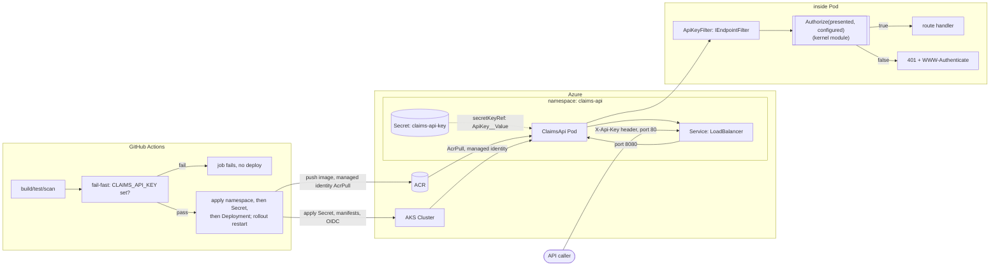

# Claims Status API Authentication — Architecture Overview

Extends `docs/architecture/2026-06-20-claims-status-api-overview.md`.
This is the first ARCHITECTURE round for this product with a non-empty
`kernel_modules` list: REQ-309 is the only `[verifiable-model]`
requirement either spec introduces, and ADR-005 draws the boundary
around exactly the `Authorize` predicate (`src/ClaimsApi/ApiKeyFilter.cs`)
— `art-kernel-boundary`'s req_map covers it. REQ-310/311/312/313/314
remain test/manifest-verified only, per the spec's own Verification
Identification section.

## Components

- **api** — unchanged from the base overview: `GET /claims`,
  `GET /claims/{claimId}`, `GET /health` mapped via `IClaimsRepository`
  (ADR-002). `claimId` stays `string`-bound and is parsed manually
  inside the handler — ADR-005 records this as a constraint the kernel
  boundary depends on, not just a style choice.
- **auth** (new) — `ApiKeyFilter`, an `IEndpointFilter` registered on
  `MapGroup("/claims")` (covering both data-returning endpoints,
  excluding `/health`). Reads `X-Api-Key`, calls the kernel module's
  `Authorize` predicate via `CryptographicOperations.FixedTimeEquals`
  (REQ-309), and on failure returns `Results.Problem(401, ...)` with
  `WWW-Authenticate: ApiKey realm="claims-api"` (REQ-311) before any
  route-handler code — including `claimId` parsing — runs.
- **k8s** — extended from the base overview: a new `Secret`
  (`claims-api-key`, namespace `claims-api`) applied before the
  `Deployment`, injected as `ApiKey__Value` via `secretKeyRef`
  (REQ-312), plus a `kubectl rollout restart` step on every deploy so a
  rotated key takes effect on existing pods (REQ-313(d)).
- **cicd** — the base overview's OIDC-gated deploy job (REQ-308) is
  extended, not replaced: a fail-fast guard on an unset
  `CLAIMS_API_KEY` repo secret, file-based (not argv) secret handling
  when creating the Kubernetes Secret, and Secret-before-Deployment
  ordering (REQ-313(a)-(c)). This ordering presumes the `claims-api`
  namespace already exists; IMPLEMENT must apply an idempotent
  namespace manifest before the Secret-create step on every run (not
  only the first), since the `CLAIMS_API_KEY`-presence guard does not
  by itself catch a missing-namespace failure on a fresh cluster — this
  is a sequencing requirement the spec's Assumptions section states as
  a precondition but REQ-313 does not itself spell out as a CI step.

## Data flow

- A caller sends `GET /claims` or `GET /claims/{claimId}` with an
  `X-Api-Key` header to the `Service`'s public IP. `ApiKeyFilter`
  intercepts the request inside `MapGroup("/claims")`, before route
  binding: it reads the header (possibly absent) and the configured key
  from `IConfiguration`, then calls `Authorize`.
- If `Authorize` returns `false` (missing or wrong key), the filter
  short-circuits with a `401` + `WWW-Authenticate` response. The route
  handler — including `claimId` GUID parsing — never executes, and
  `IClaimsRepository` is never touched. This is REQ-309's
  auth-before-routing invariant; it holds because `claimId` remains
  `string`-bound (ADR-005), so the model binder cannot produce a `400`
  ahead of the filter. This 401-takes-precedence guarantee rests on
  that one binding choice, not on anything the API's type signature
  enforces — a future change that retypes the route parameter would
  silently flip a `401` to a `400` for this case. Tests and the Dafny
  proof both cover this case (Success Metrics #1), so a regression
  would be caught, but a consumer should not assume the guarantee is
  structurally unbreakable.
- If `Authorize` returns `true`, the request proceeds exactly as in the
  base spec's data flow (REQ-300/301 unchanged).
- `GET /health` is unaffected — it sits outside the `/claims` route
  group `ApiKeyFilter` is scoped to (REQ-310).
- Separately, the deploy-time flow (GitHub Actions → ACR/AKS, disjoint
  from request-time flow) is extended: the OIDC-gated job now also
  creates/updates the `claims-api-key` Secret from the `CLAIMS_API_KEY`
  repo secret (file-based, not argv) before applying the Deployment,
  and restarts the rollout afterward.

## Verified kernel boundary
`src/ClaimsApi/ApiKeyFilter.cs`'s `Authorize` predicate — exactly the
function `verification/claims_api_auth/` models, per ADR-005. Everything
else in this spec (header parsing, `Results.Problem` shape, K8s
manifests, CI workflow steps) sits outside the kernel boundary and is
verified by tests/manifest review only, per the spec's Verification
Identification section.
