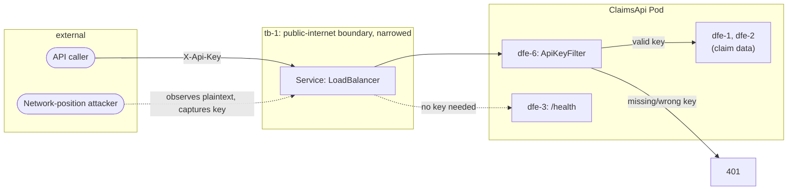

# Claims Status API Authentication — Threat Model

Extends `docs/architecture/2026-06-20-claims-status-api-threat-model.md`.
This document covers only the assets/elements this feature introduces;
`tb-1`, `dfe-1`/`dfe-2`/`dfe-3`, and the existing assets are unchanged in
definition (see the base threat model), but their narrative below is
amended where this feature changes what's true about them.

## Assets

- **api-key-secret** (C: H, I: H, A: M) — the single shared API key
  value: the GitHub Actions repo secret (`CLAIMS_API_KEY`), its
  Kubernetes Secret copy (`claims-api-key`), and the env var
  (`ApiKey__Value`) it becomes inside the pod. Rated **H** for both
  confidentiality and integrity — possession grants full read access to
  `claim-records` (the base threat model's asset), and a tampered/wrong
  value would lock out every legitimate caller. Rated **M**, not H, for
  availability: a rotation gap (REQ-313(d)) is a planned, bounded
  outage, not an open-ended one — this M rating assumes REQ-313(d)'s
  rollout-restart is implemented and actually fires on every deploy; it
  is architecture intent, not yet a verified control. VALIDATE/SECURITY
  must confirm the restart step exists and runs before treating A:M as
  settled rather than provisional.

## Trust boundary `tb-1` — narrowed, not closed

Per ADR-004's amendment, `tb-1` (public-internet ⟷ claims-api-service)
now carries `dfe-6` in addition to `dfe-1`/`dfe-2`/`dfe-3`. Reading
`dfe-1`/`dfe-2` requires passing `dfe-6` first; `dfe-3` (`/health`)
remains outside `dfe-6`'s gate entirely (REQ-310). The boundary itself —
plaintext HTTP, no TLS — is unchanged; `dfe-6` changes *who* can reach
`dfe-1`/`dfe-2` through it, not *how* the channel itself is protected.

## STRIDE coverage

- **dfe-6 (api-key-validation)** — the `ApiKeyFilter` check at the
  `/claims` route-group boundary.
  - **S (Spoofing):** a caller without the real key presents a guessed,
    stale, or stolen value to impersonate an authorized caller.
    Mitigation: `Authorize`'s exact-match comparison (REQ-309, proven by
    `verification/claims_api_auth/`) rejects any non-matching value;
    there is no partial-credit or prefix-match path.
  - **T (Tampering):** a network-position attacker captures the key in
    transit (plaintext `tb-1`) and replays it later as their own.
    Mitigation: **none at the transport layer** — this is the residual
    risk ADR-004's amendment and the auth spec's Risks section both name
    explicitly; TLS is the actual mitigation and remains out of scope.
    Bounded only by manual rotation (REQ-313(d)) once a capture is
    suspected or discovered, which has no detection mechanism in this
    version (see Repudiation note below).
  - **I (Information Disclosure):** a naive implementation could let a
    caller distinguish "key missing" from "key wrong" via response
    timing or body differences, narrowing the search space for guessing
    or confirming a captured key fragment. Mitigation: `FixedTimeEquals`
    (REQ-309's postcondition) for the timing channel; the `401` body
    never differs by failure reason (REQ-311) for the body channel.
  - **D (Denial of Service):** not rated — the comparison is a fixed-
    cost byte check (REQ-309's Non-Functional Requirements note); it
    adds no meaningful amplification of its own. If anything, `dfe-6`
    is a net DoS *improvement* for `dfe-1`/`dfe-2`: an unauthenticated
    flood is now rejected by the cheap key comparison before ever
    reaching `dfe-2`'s expensive full-dataset enumeration, rather than
    triggering that enumeration on every request as it did pre-auth.
    This is not claimed as a designed mitigation (rate limiting remains
    explicitly out of scope) — it is a side effect worth naming rather
    than leaving the DoS picture for `dfe-1`/`dfe-2` looking unchanged.

No **R (Repudiation)** rating, consistent with the base threat model's
omission rationale — the API remains read-only, and a single shared key
still does not constitute a per-caller identity: a captured-and-reused
key is indistinguishable from the legitimate holder using it, so there
is no identity to attach a denial to. This would change only if a
per-caller key/identity model is ever added (out of scope per this
spec's Won't Have).

## Amended narrative on `dfe-1`/`dfe-2` (base threat model)

The base threat model's `dfe-1`/`dfe-2` STRIDE entries state
"Mitigation [for Information Disclosure]: none today." That is now
**superseded for unauthenticated callers**: `dfe-6` gates both, so an
attacker without a valid key can no longer reach either dataflow at all
(not even to receive a 401 body containing data). For an attacker who
*has* captured a valid key (`dfe-6`'s T finding above), `dfe-1`/`dfe-2`'s
original Information Disclosure exposure is fully restored — the key
holder reads exactly what an unauthenticated caller could read before
this feature. The base document is left as-is (historical record of the
pre-auth boundary); this paragraph is the authoritative amendment.

## Mitigations summary (additive to base)

| Element | Mitigated now | Deferred / accepted |
|---|---|---|
| dfe-6 | Exact-match + fixed-time comparison; uniform 401 body | Plaintext-channel key capture (T) — accepted pending TLS, per ADR-004's amendment |

This threat model discharges the obligation the auth spec's Open
Questions #1 carried forward to ARCHITECTURE: `tb-1` is now formally
recorded as narrowed (not closed) with explicit STRIDE coverage for the
new gate (`dfe-6`), and the residual plaintext-capture risk is named
rather than left implicit in "auth added" framing. SECURITY findings
touching the new gate must cite `dfe-6`; findings touching the
unchanged plaintext-channel risk must cite `tb-1` (as before).
